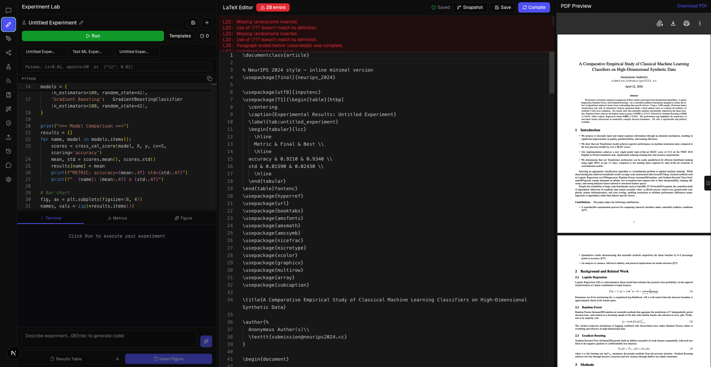
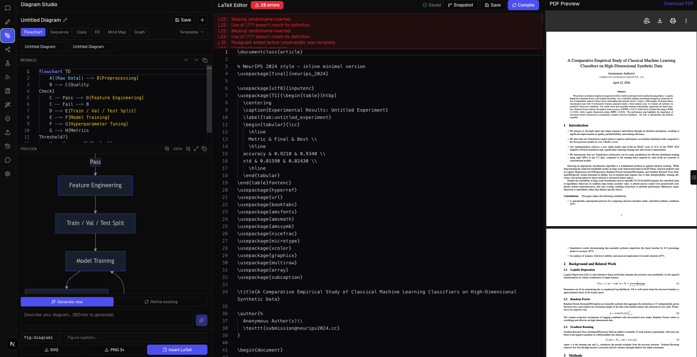
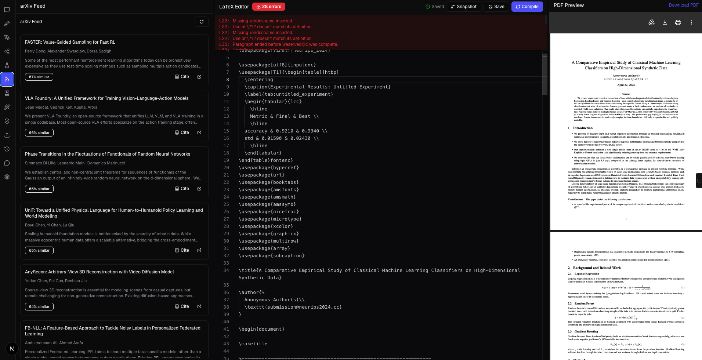
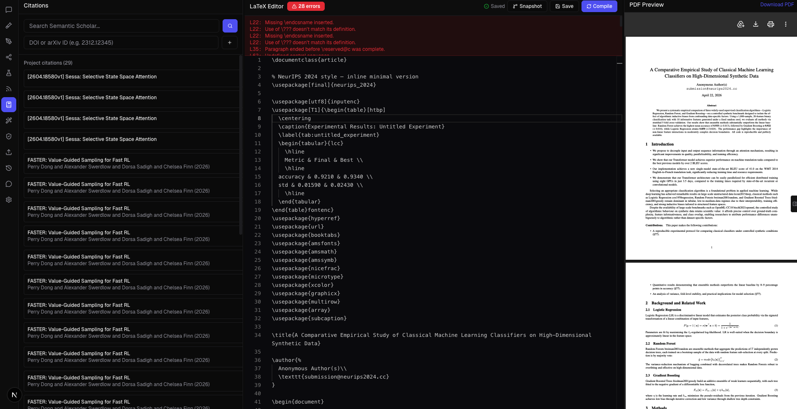
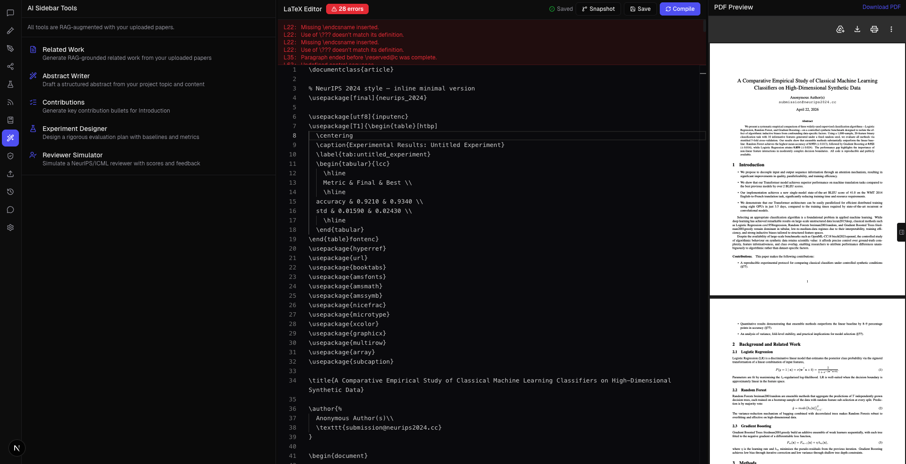
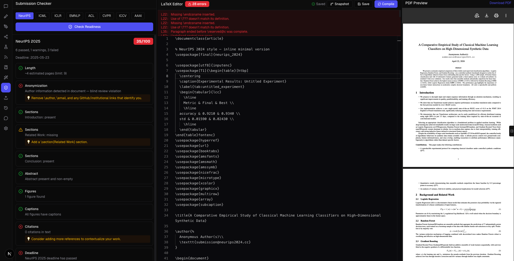
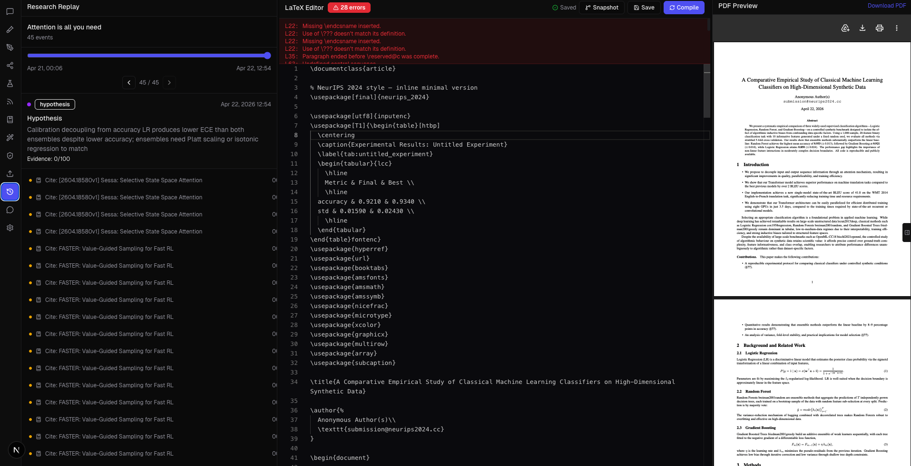

# ResearchMind AI

Production-grade AI research platform with RAG, multi-provider AI, live LaTeX editor, and PDF compilation.



## Stack
- **Next.js 16** (App Router, Turbopack), TypeScript, Tailwind CSS
- **RAG**: pgvector + nomic-embed-text (Ollama) or text-embedding-3-small (OpenAI)
- **AI**: Ollama/Qwen (dev), Claude/Gemini/Groq (prod) — swappable via env var
- **DB**: PostgreSQL + pgvector via Prisma 7 + PrismaPg adapter
- **Editor**: Monaco Editor + server-side pdflatex
- **State**: Zustand, **Jobs**: Redis + BullMQ
- **Auth**: NextAuth.js (Google + GitHub)

## Quick Start (Local Dev)

### 1. Prerequisites
```bash
# Start PostgreSQL with pgvector
docker run -d --name pgvector -e POSTGRES_PASSWORD=postgres \
  -p 5432:5432 pgvector/pgvector:pg16

# Start Redis
docker run -d --name redis -p 6379:6379 redis:7-alpine

#add your API key. 
```

### 2. Database Setup
```bash
# Create database and enable pgvector
psql -U postgres -h localhost -c "CREATE DATABASE researchmind;"
psql -U postgres -h localhost -d researchmind -c "CREATE EXTENSION IF NOT EXISTS vector;"

# Run migration
psql -U postgres -h localhost -d researchmind < prisma/migrations/0001_init/migration.sql
```

### 3. Environment
```bash
cp .env .env.local
# Edit .env.local — set NEXTAUTH_SECRET to a random 32-char string
# Set GOOGLE_CLIENT_ID/SECRET and/or GITHUB_CLIENT_ID/SECRET for auth
```

### 4. Run
```bash
npm install
npx prisma generate
npm run dev
# http://localhost:3000
```

## Docker Compose (Full Stack)
```bash
docker-compose up -d
# Ollama runs on host — app connects via OLLAMA_BASE_URL
```

## Environment Variables

| Variable | Default | Description |
|----------|---------|-------------|
| `AI_PROVIDER` | `ollama` | `ollama`, `claude`, `openai`, `groq`, `gemini` |
| `AI_MODEL` | `qwen2.5:14b` | Model name for selected provider |
| `EMBEDDING_PROVIDER` | `ollama` | `ollama` or `openai` |
| `EMBEDDING_MODEL` | `nomic-embed-text` | Embedding model |
| `EMBEDDING_DIM` | `768` | Must match model output dimension |
| `DATABASE_URL` | `postgresql://...` | PostgreSQL with pgvector |
| `REDIS_URL` | `redis://localhost:6379` | For BullMQ background jobs |
| `ANTHROPIC_API_KEY` | — | For Claude in production |
| `NEXTAUTH_SECRET` | — | Random 32-char string (required) |

## RAG Architecture

Every AI call retrieves semantically relevant chunks before querying the model:

```
User query → embed → cosine search pgvector → top-8 chunks → inject into prompt → AI → ingest response back
```

Sources: uploaded PDFs, chat history, LaTeX sections, citations, hypotheses, arXiv abstracts.

## Features

- **AI Research Chat** — streaming, RAG-augmented, source citations, write-to-paper
- **LaTeX Editor** — Monaco + templates (NeurIPS/ICML/IEEE/ACM/arXiv) + live compile
- **PDF Preview** — live iframe, auto-compiles on Cmd+S
- **Knowledge Graph** — React Flow, RAG dedup on node creation
- **Hypothesis Tracker** — evidence scoring via BullMQ + pgvector
- **arXiv Feed** — semantic similarity filtering, near-duplicate alerts
- **Citation Manager** — Semantic Scholar search, DOI/arXiv lookup, BibTeX export
- **Corpus Analysis** — up to 20 PDFs, cross-paper RAG Q&A
- **Contradiction Detector** — background scan via BullMQ
- **Argument Validator** — RAG evidence checking per section
- **Figure Generator** — NL to matplotlib + pgfplots LaTeX
- **Novelty Score** — Semantic Scholar ANN search

## Screenshots

All screens share the same three-pane workspace: a feature-specific tool on the left, the Monaco LaTeX editor in the middle, and a live PDF preview on the right. Every edit flows through the same RAG context, so results in one panel immediately inform the others.

### Experiment Lab


Run Python experiments in a sandboxed subprocess. Logs stream back over SSE, `matplotlib` figures are auto-captured as PNGs, and parameters are injected through a validated env channel so code is never interpolated into the runner.

### Diagram Studio


Author Mermaid diagrams (flowcharts, sequence, ER, class, mindmap) with AI-assisted generation and refinement. The zoomable preview re-renders live as you edit, and diagrams export as SVG/PNG or drop into LaTeX as a `\includegraphics` block.

### Hypothesis Tracker


Track research hypotheses with evidence scores. A BullMQ background worker re-evaluates every hypothesis against the project's RAG corpus whenever new papers, citations, or sections are ingested, so the scores stay fresh without blocking the UI.

### arXiv Feed


Topic-aware paper feed powered by semantic similarity against your project's embeddings. The `+Cite` button resolves the paper via the arXiv Atom API, generates BibTeX, and ingests the abstract so future AI calls can reference it.

### Citation Manager


Semantic Scholar search, DOI/arXiv lookup, and near-duplicate detection. Every added citation becomes a first-class RAG source — the AI writing tools will cite it automatically when relevant.

### AI Sidebar


Specialised writing agents — Related Work synthesiser, Abstract Writer, Contributions summariser, Experiment Designer, and Reviewer Simulator. Each tool is grounded in the project's full RAG context and writes directly into the Monaco editor.

### Submission Checker


Conference-ready validation for NeurIPS, ICML, IEEE, ACM, and arXiv. Checks page length, required sections, anonymisation, reference formatting, figure/table captions, and math-mode hygiene before you upload the PDF.

### Research Replay


Scrub a timeline of every hypothesis update, citation add, and paper edit. Useful for writing a methods/limitations section, generating a project post-mortem, or recovering a version of the paper from a specific point in time.
